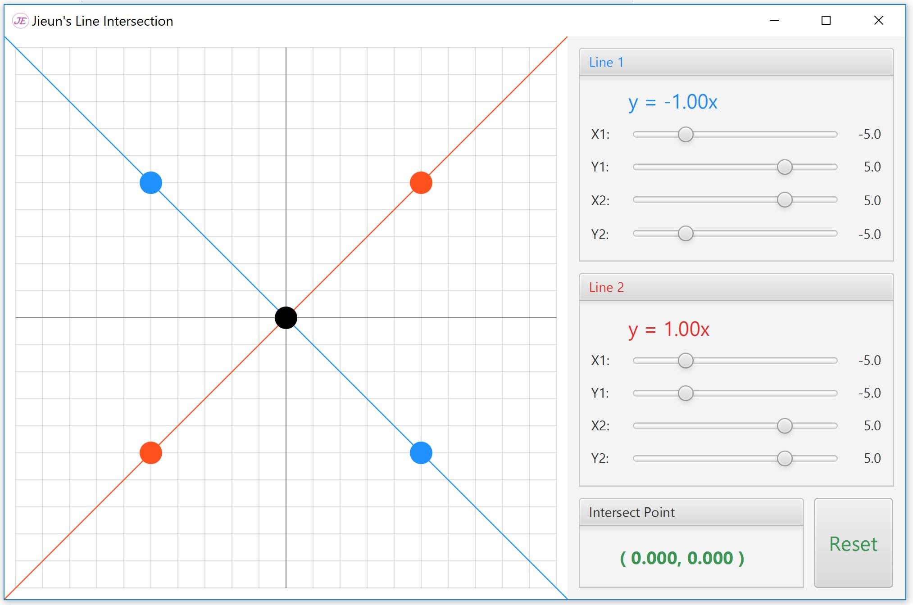
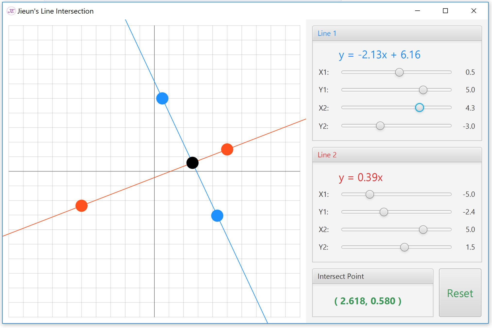

# Java-Vector

# Java Project - Using Vector, cross 2 lines and show the interscton and lines' equation

created date: Jan 2018

Description 
--------------

Java program to determine 2 lines, red and blue, are intersected or not. 
User can define 2 points using slide bar for drawing each line. 
The program provides the intersection point of two lines and line equation.

Running Program 
--------------

